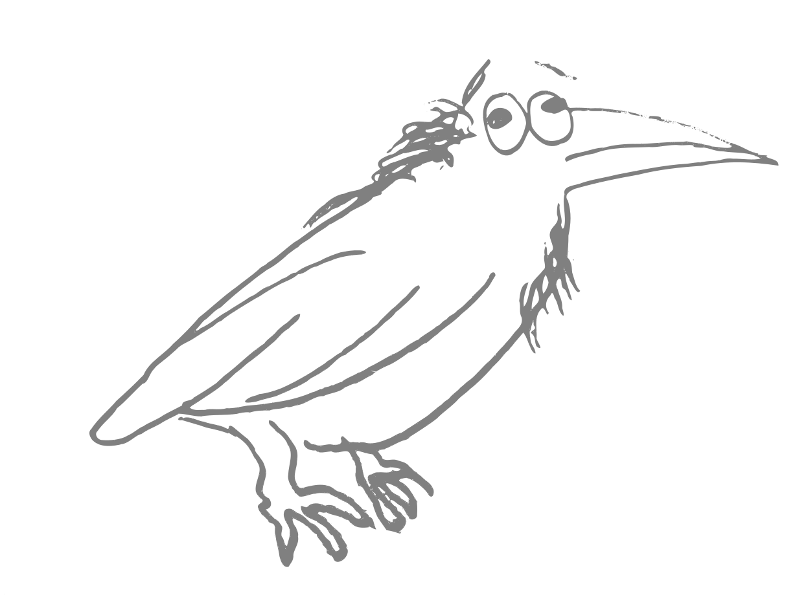

  

# Hreyfan — A Programming Language for Mobile Code

Hreyfan is a distributed systems programming language, intended for
applications where program components can be spatially distributed and
mobile. It is an object-based language, with typestate-oriented
features for ensuring safe communication, and a static, modal type
system for ensuring safe use of mobile resources.

## Origin of the name and logo

Hreyfan is old-Norse and Icelandic for "movement". Its pronounciation
in Icelandic is close to the English word "raven". Indeed, the English
and old-Norse words are deeply intertwined—Vikings used ravens to help
them navigate the seas, and discover new lands: They would take a
number of ravens with them onboard their ships. Once sufficiently far
out at sea, they would release a raven, note the direction in which it
flew, and if the raven did not come back, they could draw a hypothesis
that there was land in that direction.

Much as ravens enabled Viking mobility throughout the world, Hreyfan
enables code mobility throughout the world. Such a Norse-themed name
was also chosen because Hreyfan is heavily inspired by the programming
languages Emerald and [Erlang](https://www.erlang.org/), both having
significant Scandinavian roots.

## Credits

* Logo hand-drawn by [@athas](https://github.com/athas/), converted to
  vector graphics by [@oleks](https://github.com/oleks/)
